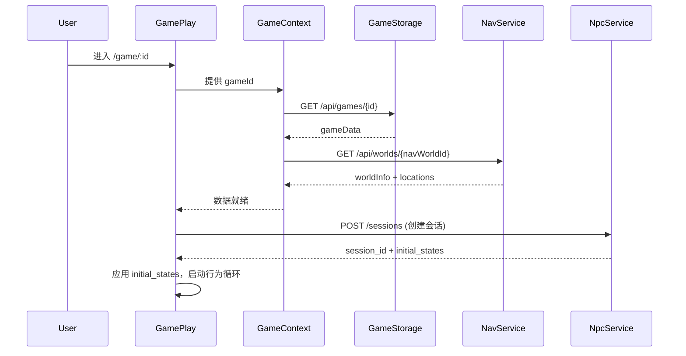
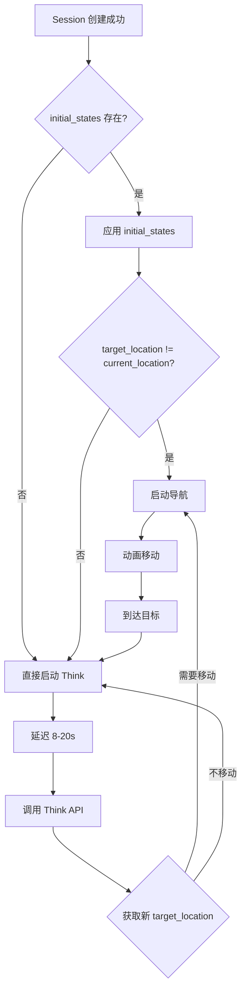

# Dynamic Play 模式 - 技术文档

## 概述

Dynamic Play 模式是游戏的核心玩法页面，允许玩家与 AI 驱动的 NPC 进行互动、观察 NPC 的自主行为，并最终做出指控以完成游戏。

---

## 架构概览

```
┌─────────────────────────────────────────────────────────────┐
│                      GamePlay.jsx                           │
│  ┌─────────────────────────────────────────────────────┐    │
│  │                  GameProvider                        │    │
│  │  - 加载游戏数据 (Game Storage Service)              │    │
│  │  - 加载地图数据 (Nav Service)                       │    │
│  └─────────────────────────────────────────────────────┘    │
│                            │                                 │
│              ┌─────────────┴─────────────┐                  │
│              ▼                           ▼                  │
│     useNpcBehavior Hook           UI Components             │
│     - Session 管理                 - GameTownMap            │
│     - Think 循环                   - GameTopBar             │
│     - 导航移动                     - GameBottomHUD          │
│     - 事件流                       - GameEventsPanel        │
│                                    - GameInfoPanel          │
└─────────────────────────────────────────────────────────────┘
```

---

## 核心数据流

### 1. 游戏初始化流程



### 2. NPC 行为循环



---

## 核心状态说明

### Session 状态

| 字段 | 类型 | 说明 |
|------|------|------|
| `sessionId` | `string` | 后端会话 ID |
| `isSessionReady` | `boolean` | 会话是否就绪 |

### NPC 状态

| 状态 | 说明 |
|------|------|
| `idle` | 空闲，可以触发 Think |
| `moving` | 正在移动中 |
| `chatting` | 与玩家对话中 |

### 位置数据

```typescript
interface Position {
  npcId: number;      // NPC ID
  xPct: number;       // X 坐标百分比 (0-100)
  yPct: number;       // Y 坐标百分比 (0-100)
  location?: string;  // 当前地点名称
}
```

### 事件数据

```typescript
interface NpcEvent {
  npcId: number;
  npcName: string;
  action: string;           // 行为描述
  targetLocation: string;   // 目标地点
  startTime: string;        // ISO 时间或 "Day X, HH:mm"
}
```

---

## API 交互

### 1. 创建 Session

**请求**：
```json
POST /sessions
{
  "current_time": "Day 1, 14:30",
  "world_setting": "垂直果园城...",
  "locations": ["中央控制室", "高级公寓区", ...],
  "npcs": [
    {
      "id": "director_thorne",
      "name": "Director Thorne",
      "current_location": "中央控制室",
      "profile": {
        "role": "核心委员会主席",
        "trait": "威严果断",
        "goal": "维护伊甸园稳定"
      }
    }
  ]
}
```

**响应**：
```json
{
  "session_id": "uuid",
  "initial_states": {
    "director_thorne": {
      "current_location": "中央控制室",
      "behavior": {
        "target_location": "高级公寓区",
        "action": "前往公寓区视察",
        "status": "ONGOING",
        "start_time": "Day 1, 14:30"
      }
    }
  }
}
```

### 2. Think API

**请求**：
```json
POST /sessions/{session_id}/npcs/{npc_id}/think
{
  "current_time": "Day 1, 14:35"
}
```

**响应**：
```json
{
  "npc_id": "director_thorne",
  "behavior": {
    "target_location": "垂直果园核心",
    "action": "检查果园核心的运行状态",
    "status": "ONGOING",
    "start_time": "Day 1, 14:35"
  }
}
```

### 3. 导航 API

**位置间导航**：
```json
POST /api/navigate/locations
{
  "world_id": "uuid",
  "from": "中央控制室",
  "to": "高级公寓区"
}
```

**坐标导航**：
```json
POST /api/navigate/coord
{
  "world_id": "uuid",
  "from_x": 100,
  "from_y": 200,
  "to": "高级公寓区"
}
```

**响应**：
```json
{
  "path": [
    {"x": 100, "y": 200},
    {"x": 105, "y": 210},
    ...
  ]
}
```

### 4. 移动上报

**开始移动**：
```json
POST /sessions/{session_id}/npcs/{npc_id}/move/start
{
  "current_time": "Day 1, 14:36",
  "from_location": "中央控制室",
  "to_location": "高级公寓区"
}
```

**到达目标**：
```json
POST /sessions/{session_id}/npcs/{npc_id}/move/arrive
{
  "current_time": "Day 1, 14:40",
  "location": "高级公寓区"
}
```

---

## UI 组件职责

| 组件 | 职责 |
|------|------|
| `GameTownMap` | 渲染地图和 NPC 头像，处理点击 |
| `GameTopBar` | 显示标题、时间、控制按钮 |
| `GameBottomHUD` | 选中 NPC 时显示操作按钮 |
| `GameEventsPanel` | 右侧事件流面板 |
| `GameInfoPanel` | NPC 详情弹窗 |

---

## 关键 Hook: useNpcBehavior

### 输入参数

| 参数 | 类型 | 说明 |
|------|------|------|
| `gameData` | `object` | 游戏数据 |
| `npcs` | `array` | NPC 列表 |
| `navWorldId` | `string` | 导航世界 ID |
| `locations` | `array` | 地点列表 |
| `positions` | `array` | NPC 位置数组 |
| `setPositions` | `function` | 更新位置 |
| `onEvent` | `function` | 事件回调 |
| `enabled` | `boolean` | 是否启用 |

### 返回值

| 字段 | 类型 | 说明 |
|------|------|------|
| `sessionId` | `string` | 当前会话 ID |
| `isSessionReady` | `boolean` | 会话是否就绪 |
| `initSession` | `function` | 初始化会话 |
| `scheduleThink` | `function` | 安排 Think 调用 |
| `startNavigation` | `function` | 启动导航 |
| `getNpcState` | `function` | 获取 NPC 状态 |

---

## 时间常量

| 常量 | 值 | 说明 |
|------|------|------|
| Think 间隔 | 8-20s | 每次 Think 后的随机延迟 |
| 导航帧率 | 40ms | 每帧移动一个路径点 |
| Think 超时 | 30s | Play.jsx 中的默认值 |

---

## 调试日志

行为循环会输出以下控制台日志：

- `[Session] 创建中...` - 开始创建会话
- `[Session] 创建成功: {id}` - 会话创建成功
- `[Session] 应用初始状态: {...}` - 应用 initial_states
- `[Init] {npc}: moving from A to B` - 初始导航
- `[Think] {npc} thinking at {loc}...` - Think 调用
- `[Nav] {npc}: A -> B` - 开始导航
- `[Nav] {npc} arrived at {loc}` - 到达目标

---

## 扩展指南

### 添加新的 NPC 行为

1. 在 `useNpcBehavior.js` 中修改 `scheduleThink` 函数
2. 处理 `res.behavior` 中的新字段
3. 更新 `upsertEvent` 以记录新类型的事件

### 添加 NPC 互动

1. 实现 `tryInteract` 函数（参考 Play.jsx）
2. 调用 `interactNpc` API
3. 处理 `behavior_updates` 响应

### 添加对话功能

1. 创建 `GameNpcChatPanel` 组件
2. 调用 `openNpcChat` / `chatWithNpc` / `closeUserChat` API
3. 在对话期间暂停 NPC 的 Think 循环
