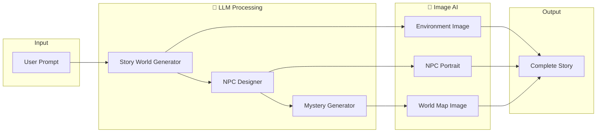
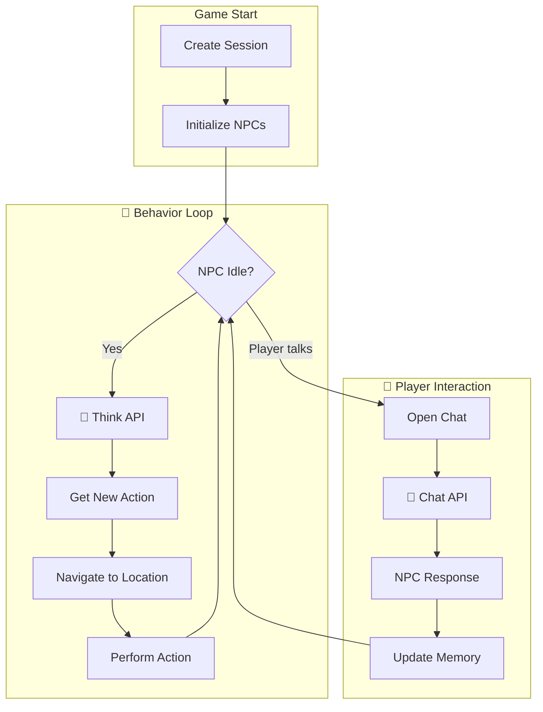

# Flimo World

[](https://github.com/socekin/flimo_world)
[](https://nodejs.org/)
[](https://creativecommons.org/licenses/by-nc-sa/4.0/)
[](https://t.me/jayfxfx)

**AI-Powered Interactive Story Creator** - Create immersive narrative worlds with AI-generated characters, scenes, and interactive mystery gameplay.

📬 **Contact: [@jayfxfx](https://t.me/jayfxfx) on Telegram**

---

## ✨ Features

| Feature | Description |
|---------|-------------|
| 🗣️ **Natural Language Creation** | Describe your world in plain English and watch it come to life |
| 🎭 **AI-Generated NPCs** | Unique characters with personalities, goals, and hidden secrets |
| 🎨 **AI Visuals** | Environment scenes and character portraits generated by AI |
| 🗺️ **Interactive World Map** | Visual world builder with draggable location markers |
| 🔍 **Mystery Game Mode** | Play through stories as interactive detective games |
| 💬 **Multi-turn Editing** | 5-turn context memory for coherent story refinement |

---

## 🛠 Tech Stack

| Category | Technology |
|----------|------------|
| Frontend | React 18 + Vite |
| Styling | Tailwind CSS + shadcn/ui |
| 3D Engine | Three.js + React Three Fiber |
| LLM | OpenRouter API (Gemini 2.5 Flash) |
| Image Generation | Google Gemini |
| Deployment | Cloudflare Pages |

---

## 🚀 Quick Start

### Prerequisites

- Node.js 18+
- [OpenRouter API Key](https://openrouter.ai/)
- [Google Gemini API Key](https://aistudio.google.com/)

### Installation

```bash
# Clone the repository
git clone https://github.com/socekin/flimo_world.git
cd flimo_world

# Install dependencies
npm install

# Copy environment example
cp .env.example .env.local
```

### Configuration

Edit `.env.local` with your API keys:

```bash
# LLM (Required)
VITE_OPENROUTER_API_KEY=your_openrouter_key
VITE_OPENROUTER_MODEL=google/gemini-3-flash-preview

# Image Generation (Required)
VITE_GEMINI_API_KEY=your_gemini_key
VITE_GEMINI_IMAGE_MODEL=gemini-2.0-flash-exp-image-generation
```

### Development

```bash
npm run dev
# Open http://localhost:5173
```

### Build

```bash
npm run build
```

---

## 📁 Project Structure

```
flimo_world/
├── src/
│   ├── agent/              # AI Agent System
│   │   ├── orchestrator/   # Workflow orchestrator
│   │   ├── router/         # Intent recognition & routing
│   │   └── skills/         # Modular skill modules (19+ skills)
│   ├── components/         # Shared React components
│   ├── pages/              # Page components (Create, Play, Game)
│   ├── game/               # 3D game mode components
│   ├── lib/                # API clients & utilities
│   └── i18n/               # Internationalization
├── public/                 # Static assets (images, videos, fonts)
└── *.json                  # Sample story & NPC data
```

---

## 🎮 How It Works

### Create Mode - AI-Powered Story Generation



**Create Mode LLM Skills (18 Skills):**

| Skill | LLM Call | Description |
|-------|----------|-------------|
| `story-world` | ✅ | Generate world setting, background, truth |
| `story-npc` | ✅ | Create NPCs with personalities & secrets |
| `mystery-world` | ✅ | Generate mystery plot & clues |
| `mystery-npc` | ✅ | Create NPC dual versions (creator/player) |
| `environment-image` | ✅ | Generate scene images via Gemini |
| `npc-image` | ✅ | Generate character portraits |
| `worldmap-layout` | ✅ | Plan location layout on map |
| `worldmap-image` | ✅ | Generate final world map image |

---

### Play Mode - AI-Driven NPC Behavior



**Play Mode LLM APIs:**

| API | LLM Call | Description |
|-----|----------|-------------|
| `POST /sessions` | ✅ | Initialize NPC states with AI |
| `POST /npcs/{id}/think` | ✅ | NPC decides next action |
| `POST /chat` | ✅ | NPC responds to player |
| `POST /interact` | ✅ | NPC-to-NPC dialogue |
| `POST /chat/open` | ✅ | NPC greeting when player opens chat |
| `POST /chat/close` | ✅ | Summarize conversation to memory |

---

## 🤝 Contributing

Contributions are welcome! Please feel free to submit a Pull Request.

1. Fork the repository
2. Create your feature branch (`git checkout -b feature/amazing-feature`)
3. Commit your changes (`git commit -m 'Add some amazing feature'`)
4. Push to the branch (`git push origin feature/amazing-feature`)
5. Open a Pull Request

---

## 📝 License

This project is licensed under [CC BY-NC-SA 4.0](https://creativecommons.org/licenses/by-nc-sa/4.0/).

- ✅ **Attribution** - You must give appropriate credit
- ✅ **ShareAlike** - Derivatives must use the same license
- ❌ **NonCommercial** - Commercial use is not permitted

---

## 🙏 Acknowledgements

- [OpenRouter](https://openrouter.ai/) - LLM API Gateway
- [Google Gemini](https://deepmind.google/technologies/gemini/) - AI Image Generation
- [Three.js](https://threejs.org/) - 3D Graphics
- [Vite](https://vitejs.dev/) - Build Tool
- [Tailwind CSS](https://tailwindcss.com/) - Styling

---

Made with ❤️ by Jay
